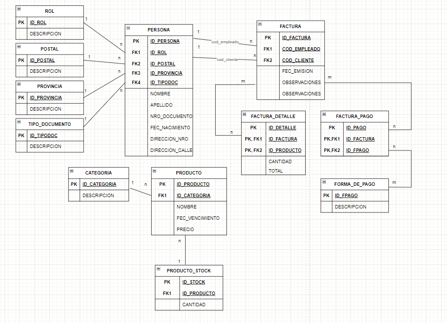

# <center> Proyecto Final - Merussi </center>

#### Alumno: Valentina Reigada

#### Comision: 53180

#### Tutor: Santiago Angel Gonzalez Martin

#### Docente: Anderson Michel Torres

---

### Dominio:

El cliente solicita crear una base de datos para poder administrar el negocio familiar. Requiere poder tener un control de las personas que pertenecen al local, ya sea personal o clientes.
Tambien poder tener un control sobre los productos que se venden en el local, asi se puede llevar un seguimiento del stock, vencimientos y datos de los mismos. Y Por ultimo, solicita tener
un monitoreo de facturación, es decir, poder crear/ver facturas con todos los datos que está conlleva: personas involucradas en la venta (personal, cliente), forma de pago, productos vendidos y total
de la compra.

Para poder llevar a cabo la idea del cliente, se modelan las siguientes tablas para poder abarcar todas las necesidades previamente dichas:

## Diagrama Entidad Relación (DER)

<center></center>
<center> MODELO ENTIDAD RELACIÓN </center>

### Tablas:

**Para representar la información de las personas:**

- Persona
- Rol
- Tipo_Documento
- Postal
- Provincia

**Para representar la infomación de los productos:**

- Producto
- Producto_Stock
- Categoria

**Para representar la información de la facturación:**

- Factura
- Factura_Detalle
- Factura_Pago
- Forma_De_Pago

### Diccionario de datos:

1. **Rol:** Se encarga de representar los diferentes rol que puede tener una persona en el negocio. Entre las posibilidades hay: Dueño, Cliente, Empleado.

2. **Tipo_Documento:** Se encarga de representar los distintos tipos de documento que existen.

3. **Postal:** Se encarga de representar los distintos código postal que existen.

4. **Provincia:** Se encarga de representar las provincias del Pais.

5. **Forma_De_Pago:** Se encarga de representar las diferentes formas de pago que puede aceptar el negocio. Entre ellas estan: Efectivo, Transferencia, Tarjeta Débito, Tarjeta Crédito.

6. **Categoria:** Se encarga de representar las diferentes categorias de productos que hay en el negocio.

7. **Persona:** Se encarga de representar la información correspondiente a una Persona.

8. **Producto:** Se encarga de representar la información correspondiente a un Producto.

9. **Producto_Stock:** Se encarga de representar el stock de Productos.

10. **Factura:** Se encarga de representar la información de facturación de cada compra, aqui está relacionada la tabla **Persona**. Está relación se da para poder declarar el cliente y empleado que facturó.

11. **Factura_Detalle:** Se encarga de representar el detalle de la Factura, donde se encuentran los productos que se facturaron en la compra, la cantidad total de productos y su monto final.

12. **Factura_Pago:** El cliente solicita tener la posibilidad de tener mas de una forma de pago, ya que a veces los clientes pagan una parte del monto de la factura con efectivo y la otra con tarjeta. Por este motivo se crea una tabla intermedia para representar las formas de pago que tuvó la factura
    y el monto que se efectuó en esa opción de pago.

### Estructura de las tablas:

| Tabla           | Columna         |                             Tipode Datos |
| --------------- | --------------- | ---------------------------------------: |
| ROL             | ID_ROL          |                                      INT |
|                 | DESCRIPCION     |                              VARCHAR(20) |
| TIPO_DOCUMENTO  | ID_TIPODOC      |                                      INT |
|                 | DESCRIPCION     |                              VARCHAR(20) |
| POSTAL          | ID_POSTAL       |                                      INT |
|                 | DESCRIPCION     |                              VARCHAR(20) |
| PROVINCIA       | ID_PROVINCIA    |                                      INT |
|                 | DESCRIPCION     |                              VARCHAR(20) |
| FORMA_DE_PAGO   | ID_FPAGO        |                                      INT |
|                 | DESCRIPCION     |                              VARCHAR(20) |
| CATEGORIA       | ID_CATEGORIA    |                                      INT |
|                 | DESCRIPCION     |                              VARCHAR(20) |
| PERSONA         | ID_PERSONA      |                                      INT |
|                 | ID_ROL          |                                      INT |
|                 | NOMBRE          |                              VARCHAR(30) |
|                 | APELLIDO        |                              VARCHAR(30) |
|                 | ID_TIPODOC      |                                      INT |
|                 | NRO_DOCUMENTO   |                              VARCHAR(20) |
|                 | FEC_NACIMIENTO  |              DATE DEFAULT Current_Date() |
|                 | DIRECCION_NRO   |                             NUMERIC(4,0) |
|                 | DIRECCION_CALLE |                              VARCHAR(30) |
|                 | ID_POSTAL       |                                      INT |
|                 | ID_PROVINCIA    |                                      INT |
| PRODUCTO        | ID_PRODUCTO     |                                      INT |
|                 | ID_CATEGORIA    |                                      INT |
|                 | NOMBRE          |                              VARCHAR(30) |
|                 | FEC_VENCIMIENTO |                                     DATE |
|                 | PRECIO          |                            NUMERIC(18,2) |
| PRODUCTO_STOCK  | ID_STOCK        |                                      INT |
|                 | ID_PRODUCTO     |                                      INT |
|                 | CANTIDAD        |                             NUMERIC(3,0) |
| FACTURA         | ID_FACTURA      |                                      INT |
|                 | COD_EMPLEADO    |                                      INT |
|                 | COD_CLIENTE     |                                      INT |
|                 | FEC_EMISION     |              DATE DEFAULT Current_Date() |
|                 | OBSERVACIONES   | VARCHAR(100) DEFAULT 'SIN OBSERVACIONES' |
| FACTURA_DETALLE | ID_DETALLE      |                                      INT |
|                 | ID_FACTURA      |                                      INT |
|                 | ID_PRODUCTO     |                                      INT |
|                 | CANTIDAD        |                             NUMERIC(3,0) |
|                 | TOTAL           |                            NUMERIC(18,2) |
| FACTURA_PAGO    | ID_PAGO         |                                      INT |
|                 | ID_FACTURA      |                                      INT |
|                 | ID_FPAGO        |                                      INT |

---

## <center> Objetos de la base de datos </center>

- ### Documentacion de Vistas

### Vista: vw_ventas_de_abril (Facturas emitidas en el mes de Abril)

**Descripción:** Esta vista muestra las facturas emitadas en el mes de abril, con la información del personal que facturó, el cliente, fecha y monto total.

**Columnas:**

- **NRO_FACTURA:** Nro. de la Factura.
- **NOMBRE_EMPLEADO:** Nombre del Empleado del Negocio que facturó.
- **NOMBRE_CLIENTE:** Nombre del Cliente.
- **FECHA_EMISION:** Fecha de Emisión de la Factura.
- **TOTAL_COMPRA:** Importe total de la Factura.

**Tablas que la componen:** Factura, Factura_Detalle, Persona.

### Vista: vw_facturas_en_efectivo (Facturas que fueron abonadas con 100% Efectivo)

**Descripción:** Esta vista muestra las facturas que fueron abonadas el 100% del monto.con el método de pago: EFECTIVO.

**Columnas:**

- **NRO_FACTURA:** Nro. de la Factura.
- **NOMBRE_EMPLEADO:** Nombre del Empleado del Negocio que facturó.
- **NOMBRE_CLIENTE:** Nombre del Cliente.
- **FECHA_EMISION:** Fecha de Emisión de la Factura.
- **TOTAL:** Importe total de la Factura.

**Tablas que la componen:** Factura, Factura_Pago, Persona.

### Vista: vw_productos_a_reponer (Productos que tienen un stock menor a 10 unidades)

**Descripción:** Esta vista muestra los productos a reponer. Estos productos tienen un stock menor a 10 unidades.

**Columnas:**

- **ID_PRODUCTO:** ID. Producto.
- **NOMBRE:** Nombre del producto.
- **CANTIDAD:** Cantidad de stock del producto.

**Tablas que la componen:** Producto, Producto_Stock.

- ### Documentacion de Funciones

### Función: cant_personas_segun_rol

**Descripción:** Esta función cuenta la cantidad de personas asignadas al rol dado por parámetro.

**Parámetros:**

- **rol:** Identificador único de Rol. Tipo INT.

**Retorno:**

- Tipo INT : Número total de personas asignadas al rol dado.

**Tablas que la componen** PERSONA.

### Función: tieneStock

**Descripción:** Esta función indica si el producto dado por parámtro tiene stock.

**Parámetros:**

- **ID:** Identificador único de Producto. Tipo INT.

**Retorno:**

- Tipo Booleano: Indica si el producto tiene stock.

**Tablas que la componen** PRODUCTO_STOCK.

### Función: facturasDelEmpleado

**Descripción:** Esta función cuenta la cantidad de facturas emitidas por el empleado dado por parámetro.

**Parámetros:**

- **ID:** Identificador único de Empleado. Tipo INT.

**Retorno:**

- Tipo INT: Cantidad total de facturas emitidas por el empleado dado.

**Tablas que la componen** FACTURA.

### Función: nombreCompleto

**Descripción:** Esta función retorna el nombre completo de la persona dada por parámetro.

**Parámetros:**

- **ID:** Identificador único de Persona. Tipo INT.

**Retorno:**

- Tipo VARCHAR: Nombre completo de la Persona dada.

**Tablas que la componen** PERSONA

### Función: productoEstrella

**Descripción:** Esta funcion retorna el id del producto mas vendido

**Retorno:**

- Tipo INT: Identificador único del Producto mas vendido del negocio.

**Tablas que la componenen** FACTURA_DETALLE.

- ### Documentacion de Stored Procedures

### Procedimiento: crear_persona

**Descripción:** Este procedimiento crea un nueva persona en la base de datos.

**Parámetros:**

- **p_rol:** Rol de la Persona.
- **p_nombre:** Nombre de la Persona.
- **p_apellido:** Apellido de la Persona.
- **p_tipo_doc:** Tipo Documento de la Persona.
- **p_nro_doc:** Nro. Documento de la Persona.
- **p_fec_nac:** Fecha nacimiento de la Persona.
- **p_dir_nro:** Nro. de Dirrección de la Persona.
- **p_dir_calle:** Calle de Dirrección de la Persona.
- **p_id_postal:** Identificador del Cod. Postal de la Persona.
- **p_id_prov:** Identificador de la Provincia donde vive la Persona.

**Retorno:**

- Mensaje de éxito o error

**Beneficio que aporta:¨** Facilitar la inserción de una nueva Persona al Negocio.

**Ejemplo de uso:**

```sql
CALL crear_persona(1, 'VALENTINA', 'COBACHO', 1, '1233211', '1999-10-01', 122, 'VALENCIA', 1, 1);
```

### Procedimiento: crear_productoYSuStock

**Descripción:** Este procedimiento crea un nuevo Producto con su Stock

**Parámetros:**

- **p_categoria:** Identificador de Categoria.
- **p_nombre:** Nombre del Producto.
- **p_fecha:** Fecha vencimiento del Producto.
- **p_precio:** Precio del Producto
- **p_stock:** Stock del nuevo Producto

**Retorno:**

- Mensaje de éxito o error

**Beneficio que aporta:¨** Facilitar la inserción de un nuevo Producto al negocio.

**Ejemplo de uso:**

```sql
CALL crear_productoYSuStock(8, 'IBUPROFENO', '2030-01-01', 350.00, 10);
```

### Procedimiento: actualizarStockDesdeFactura

**Descripción:** Este procedimiento recibe una factura y actualiza el stock de los productos vendidos en la misma.

**Parámetros:**

- **p_factura:** Identificador de Factura.

**Retorno:**

- Mensaje de éxito o error

**Beneficio que aporta:¨** Facilitar la actualización del stock de un Producto una vez que fue vendido en una factura.

**Ejemplo de uso:**

```sql
CALL actualizarStockDesdeFactura(2);
```

- ### Documentacion de Triggers

### Trigger: after_insert_trigger

**Descripción:** Este trigger registra la inserción de un nueva Persona en la tabla LOG_CAMBIOS.

**Detalles:**

- **Tabla afectada:** PERSONA
- **Acción:** INSERT
- **Información registrada:** Tabla Afectada, Accion, Fecha, ID de la Persona, Observaciones.

### Trigger: before_update_productoStock_trigger

**Descripción:** Este trigger verifica que hay suficiente stock del producto
antes de actualizarlo.

**Detalles:**

- **Tabla afectada:** PRODUCTO_STOCK
- **Acción:** UPDATE
- **Validación:** Stock suficiente.

### Trigger: after_update_productoStock_trigger

**Descripción:** Este trigger registra la actualización del stock de un producto cuando la cantidad resultante es 0 en la tabla LOG_CAMBIOS.

**Detalles:**

- **Tabla afectada:** PERSONA
- **Acción:** UPDATE
- **Información registrada:** Tabla Afectada, Accion, Fecha, ID de la Persona, Observaciones.

---

## Roles y permisos

Para la manipulación de los datos del negocio, se pensaron 3 roles principales. Los mismos se detallan a continuación.

- ROL DUEÑO,
- ROL EMPLEADO_NUEVO
- ROL EMPLEADO_EXPERTO

El rol dueño es el rol con el total de privilegios para manipular la base de datos. Luego, le sigue EMPLEADO_EXPERTO el cual
tiene los permisos para manipular el abm de la bd, es decir, puede ver, insertar, editar o borrar datos de las tablas. Por último, el rol EMPLEADO_NUEVO, este rol se crea con el fin de tener acceso solo para visualizar la bd.
El ultimo rol fue solicitado por el cliente, con el fin de faciliar la capacitación/adaptación de un nuevo empleado. Este rol permite que
el empleado nuevo primero tenga permiso para ver los datos asi los conoce y a medida que pasa el tiempo se le otorgará los permisos siguientes.
Los usuarios creados para la asignación de los roles son:

- dueno@localhost
- read_empleado_nuevo@localhost
- rw_empleado_experto@localhost

Cada usuario asignado al rol tiene su contraseña para loguearse en el SGBD.

---

## Back up de la base de datos

Se realizó un Backup de MERUSSI para tener un respaldo de los datos y la estructora de la bd. El mismo se encuentra en la carpeta BACKUPS.

---

## Herramientas y tecnologias usadas

- **SGBD:** MySql Workbench
- **Repositorio:** GitHub
- **Editor de texto:** Visual Studio Code
- **Creación de Diagrama:** Drawio

---

## Pasos para correr proyecto:

- **1)** Abrir MySql Workbench, luego conectarse y abrir los archivos de la carpeta **Estructura** y correrlo en el siguiente orden: Creacion_Tablas, Insercion_Datos, Relaciones_Tablas, Roles_Usuarios.
- **2)** Luego para poder crear los objetos: Funciones, Procedimientos, Triggers y vistas se debe abrir los archivos de la carpeta **Objetos** y correrlo en el orden que desee.
- **3)** Una vez que corre los archivos de las carpetas mencionadas, ya tendrá la Base de Datos Merussi instalada y lista para usar.
